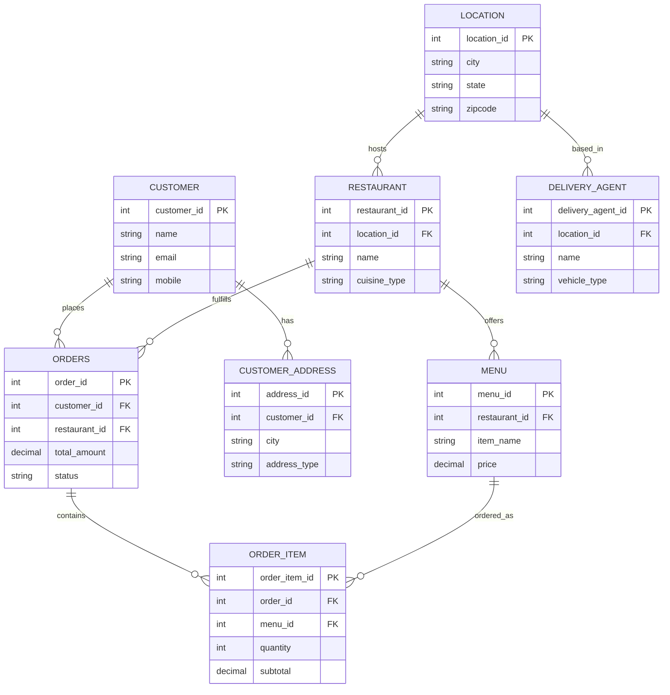

# FreshCart — Governed Snowflake Data Pipeline

**Status:** In Progress (Snowflake Professional certification companion project)
**Owner:** Aman Benjamin Emmanuel
**Repo:** TBD — `github.com/beawesome8/FreshCart-Data-Pipeline` (suggested)

---

## 1. Problem Statement

Food-delivery platforms generate high-volume, multi-entity operational data (orders, customers,
restaurants, delivery agents, addresses) that must be transformed from raw OLTP exports into a
governed, query-ready analytical model — without manual intervention, without exposing PII to
downstream consumers, and with automated detection when incoming data breaks assumptions.

FreshCart is a simulated food-delivery platform used to build and demonstrate that pipeline
end-to-end in Snowflake.

## 2. What This Project Demonstrates

- Medallion (multi-layer) data warehouse design in Snowflake: **Stage → Clean → Consumption**
- Change Data Capture using Snowflake **Streams**
- Scheduled, dependency-aware orchestration using Snowflake **Tasks** (not manual script execution)
- **Data quality gates**: automated validation before promotion between layers, with failures logged
- **Governance**: PII tagging and dynamic data masking policies applied at the column level, enforced by role
- **SCD Type 2** dimensional modeling for slowly-changing entities (restaurants, customers, delivery agents)
- **CI/CD**: schema and pipeline objects version-controlled and deployed via GitHub Actions
- A consumption-layer **Streamlit dashboard** plus a warehouse **cost/credit monitoring view**

This is explicitly *not* positioned as a from-scratch novel architecture — medallion + SCD2 is a
standard pattern. The differentiator is the automation, governance, and CI/CD layered on top,
which most single-session tutorial builds skip.

## 3. Architecture

```
Source CSVs
     │
     ▼
┌─────────────┐   COPY INTO + Stream (CDC)
│  STAGE_SCH   │  raw, all-text, audit columns, append-only streams
└─────┬───────┘
      │  MERGE (typed cast, validated)
      ▼
┌─────────────┐   Data Quality Task: null / FK / row-count checks
│  CLEAN_SCH   │  typed, deduplicated, PII-tagged
└─────┬───────┘
      │  MERGE (SCD2 dims + fact)
      ▼
┌─────────────┐
│CONSUMPTION_ │  dimensions (SCD2) + fact table + reporting views
│    SCH      │
└─────┬───────┘
      │
      ▼
Streamlit Dashboard  +  Cost Monitoring View
```

Entities: `location`, `restaurant`, `customer`, `customer_address`, `menu`, `delivery_agent`,
`delivery`, `orders`, `order_item`.

## 3a. Entity Relationship Diagram — Source Model (Stage Layer)

Reflects the 8 entities actually built in Phase 1. The dimensional (star schema) ERD will be
added here once Phase 4 is complete — it will look different from this one, since facts/SCD2
dimensions aren't a 1:1 mirror of the source model.



**Notable gap, on purpose:** there's no standalone `DELIVERY` entity linking an order to a
delivery agent and address — the original tutorial this project is inspired by has one; this
schema folds delivery status into the `ORDERS`/fact layer instead, to keep the source model at 8
entities rather than 9. Worth deciding explicitly in Phase 4 whether that simplification holds up
once you're building delivery-performance KPIs, or whether it needs to be reintroduced.

## 4. Governance & Security

**Edition constraint:** Built on Snowflake **Standard Edition**, which does not support native
Dynamic Data Masking or (potentially) object tagging — these are Enterprise-and-above features.
Deliberate trade-off: stayed on Standard rather than spinning up a separate Enterprise trial, to
keep this reproducible on the free tier most people (and most interviewers who want to poke at
the repo) will actually have access to.

**Substitute pattern — Secure Views:** PII protection is implemented as `SECURE VIEW`s in
`consumption_sch` that conditionally mask column values based on `CURRENT_ROLE()`, e.g. mobile,
email, gender, DOB, restaurant phone. Unmasked access limited to a dedicated `PII_VIEWER` role;
every other role sees masked/redacted values when querying through the view.

**Known limitation of this approach (documented on purpose, not hidden):** native masking
policies enforce centrally on the base table across *every* downstream query, including direct
table access. Secure views only protect access that goes *through the view* — anyone granted
direct SELECT on the base table bypasses the masking entirely. In a real production environment
this gap would need to be closed with column-level SELECT grants restricting base-table access
to a service role only. Documented here rather than glossed over, because being able to name the
trade-off honestly is worth more in an interview than pretending Standard Edition can do what
Enterprise does.

## 5. Data Quality Gates (the actual differentiator)

A `DQ_LOG` table in `COMMON` schema records, per pipeline run:
- row counts in vs. out at each layer transition
- null-rate on required columns
- orphaned foreign keys (order referencing a non-existent restaurant, etc.)
- a `PASS`/`FAIL` status that blocks the downstream Task from firing on `FAIL`

**Multi-FK granularity:** tables with more than one foreign key (`orders` → customer + restaurant;
`order_item` → orders + menu) log a `fk_check_detail` column in addition to the aggregate
`fk_check_status` — e.g. `customer_id:PASS;restaurant_id:PASS`. Without this, a `FAIL` on a
two-FK table tells you *that* something broke but not *which* relationship broke, forcing manual
investigation every time. Known limitation of this design: `fk_check_detail` is a delimited string
built for human readability in the log, not a normalized structure — querying "how often has
`restaurant_id` specifically failed across all runs" would require string parsing, not a clean
`WHERE` clause. Acceptable for a log a person reads; would need redesigning (e.g. a separate
`dq_fk_detail` child table, one row per FK per run) if this log ever became input to automated
alerting.

This turns "the pipeline ran" into "the pipeline ran *and the data is trustworthy*" — the claim
that actually matters to an employer.

## 6. Orchestration

Snowflake `TASK` objects, one per layer transition, chained via `AFTER` dependencies:

```
TASK_STAGE_TO_CLEAN  →  TASK_DQ_CHECK  →  TASK_CLEAN_TO_CONSUMPTION
```

Scheduled on a cron (daily), with a manual trigger option documented for demo purposes.

## 7. CI/CD

- All DDL, MERGE logic, Task definitions, and masking policies live as `.sql` files in `/sql`,
  organized by layer.
- Deployment via `schemachange` (or native Snowflake Git integration) triggered by a GitHub Actions
  workflow on merge to `main`.
- No manual "run this script in the Snowsight worksheet" step in the final version — that's the
  tutorial pattern this project deliberately moves past.

## 8. Tech Stack

Snowflake Standard Edition (Warehouses, Streams, Tasks, Secure Views, RBAC) · SQL ·
Streamlit-in-Snowflake · GitHub Actions · schemachange

## 9. Roadmap

- [ ] Phase 0 — Environment setup (warehouse, database, schemas, file formats, stages)
- [ ] Phase 1 — Stage layer: raw tables + streams for all 8 entities
- [ ] Phase 2 — Clean layer: typed tables + MERGE + PII tags/masking
- [ ] Phase 3 — Data quality gate + DQ_LOG
- [ ] Phase 4 — Consumption layer: SCD2 dimensions + fact table
- [ ] Phase 5 — Task orchestration (chained, scheduled)
- [ ] Phase 6 — Streamlit dashboard + cost monitoring view
- [ ] Phase 7 — CI/CD (schemachange + GitHub Actions)
- [ ] Phase 8 — Documentation, ERD diagram, portfolio write-up