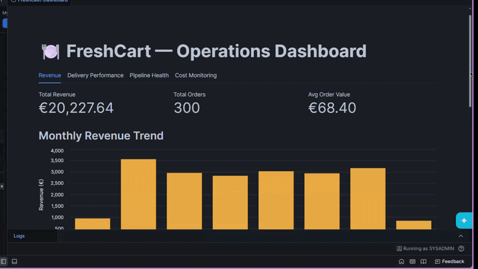
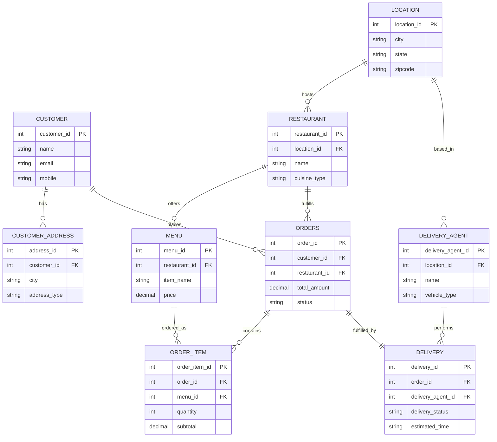

# FreshCart — Governed Snowflake Data Pipeline

**Status:** In Progress (Snowflake Professional certification companion project)
**Owner:** Aman Benjamin Emmanuel
**Repo:** TBD — `github.com/beawesome8/FreshCart-Data-Pipeline` (suggested)

---

## Dashboard Preview



The live app runs as **Streamlit in Snowflake** — native, RBAC-gated, no public URL by design
(unlike a standalone Streamlit deployment, Snowflake doesn't offer a public link for this
version). The GIF above is a full walkthrough of all four tabs — Revenue, Delivery Performance,
Pipeline Health, and Cost Monitoring — since that's how the app is actually reachable by anyone
without direct Snowflake account access.

---

## 1. Problem Statement

Food-delivery platforms generate high-volume, multi-entity operational data (orders, customers,
restaurants, delivery agents, addresses) that must be transformed from raw OLTP exports into a
governed, query-ready analytical model — without manual intervention, without exposing PII to
downstream consumers, and with automated detection when incoming data breaks assumptions.

FreshCart is a simulated food-delivery platform used to build and demonstrate that pipeline
end-to-end in Snowflake.

## 2. What This Project Demonstrates

- Medallion (multi-layer) data warehouse design in Snowflake: **Stage → Clean → Consumption**
- Change Data Capture using Snowflake **Streams**
- Scheduled, dependency-aware orchestration using Snowflake **Tasks** (not manual script execution)
- **Data quality gates**: automated validation before promotion between layers, with failures logged
- **Governance**: PII tagging and dynamic data masking policies applied at the column level, enforced by role
- **SCD Type 2** dimensional modeling for slowly-changing entities (restaurants, customers, delivery agents)
- **CI/CD**: schema and pipeline objects version-controlled and deployed via GitHub Actions
- A consumption-layer **Streamlit dashboard** plus a warehouse **cost/credit monitoring view**

This is explicitly *not* positioned as a from-scratch novel architecture — medallion + SCD2 is a
standard pattern. The differentiator is the automation, governance, and CI/CD layered on top,
which most single-session tutorial builds skip.

## 3. Architecture

```
Source CSVs
     │
     ▼
┌─────────────┐   COPY INTO + Stream (CDC)
│  STAGE_SCH   │  raw, all-text, audit columns, append-only streams
└─────┬───────┘
      │  MERGE (typed cast, validated)
      ▼
┌─────────────┐   Data Quality Task: null / FK / row-count checks
│  CLEAN_SCH   │  typed, deduplicated, PII-tagged
└─────┬───────┘
      │  MERGE (SCD2 dims + fact)
      ▼
┌─────────────┐
│CONSUMPTION_ │  dimensions (SCD2) + fact table + reporting views
│    SCH      │
└─────┬───────┘
      │
      ▼
Streamlit Dashboard  +  Cost Monitoring View
```

Entities: `location`, `restaurant`, `customer`, `customer_address`, `menu`, `delivery_agent`,
`delivery`, `orders`, `order_item`.

## 3a. Entity Relationship Diagram — Source Model (Stage Layer)

Reflects the 9 entities built across Phase 1 and the Phase 4 addendum (`DELIVERY`, added once
delivery-performance KPIs were scoped in). The dimensional (star schema) ERD is added below once
Phase 4's fact/dimension build is fully verified.



**Design decision (documented, not a gap):** `DELIVERY` models one delivery per order — no
re-delivery attempts or split shipments. `order_item_fact` sits at order-item grain while delivery
attributes are at order grain, so delivery status/agent repeat across an order's line items in the
fact table. Standard star-schema behavior, not a modeling error.

## 4. Governance & Security

**Edition constraint:** Built on Snowflake **Standard Edition**, which does not support native
Dynamic Data Masking or (potentially) object tagging — these are Enterprise-and-above features.
Deliberate trade-off: stayed on Standard rather than spinning up a separate Enterprise trial, to
keep this reproducible on the free tier most people (and most interviewers who want to poke at
the repo) will actually have access to.

**Substitute pattern — Secure Views:** PII protection is implemented as `SECURE VIEW`s in
`consumption_sch` that conditionally mask column values based on `CURRENT_ROLE()`, e.g. mobile,
email, gender, DOB, restaurant phone. Unmasked access limited to a dedicated `PII_VIEWER` role;
every other role sees masked/redacted values when querying through the view.

**Known limitation of this approach (documented on purpose, not hidden):** native masking
policies enforce centrally on the base table across *every* downstream query, including direct
table access. Secure views only protect access that goes *through the view* — anyone granted
direct SELECT on the base table bypasses the masking entirely. In a real production environment
this gap would need to be closed with column-level SELECT grants restricting base-table access
to a service role only. Documented here rather than glossed over, because being able to name the
trade-off honestly is worth more in an interview than pretending Standard Edition can do what
Enterprise does.

## 5. Data Quality Gates (the actual differentiator)

A `DQ_LOG` table in `COMMON` schema records, per pipeline run:
- row counts in vs. out at each layer transition
- null-rate on required columns
- orphaned foreign keys (order referencing a non-existent restaurant, etc.)
- a `PASS`/`FAIL` status that blocks the downstream Task from firing on `FAIL`

**Multi-FK granularity:** tables with more than one foreign key (`orders` → customer + restaurant;
`order_item` → orders + menu) log a `fk_check_detail` column in addition to the aggregate
`fk_check_status` — e.g. `customer_id:PASS;restaurant_id:PASS`. Without this, a `FAIL` on a
two-FK table tells you *that* something broke but not *which* relationship broke, forcing manual
investigation every time. Known limitation of this design: `fk_check_detail` is a delimited string
built for human readability in the log, not a normalized structure — querying "how often has
`restaurant_id` specifically failed across all runs" would require string parsing, not a clean
`WHERE` clause. Acceptable for a log a person reads; would need redesigning (e.g. a separate
`dq_fk_detail` child table, one row per FK per run) if this log ever became input to automated
alerting.

### Worked example: a real caught failure

Rather than assert the gate works, it was deliberately tested against real bad data:

1. **Injected** a row into `stage_sch.menu` with `created_date = 'NOT_A_DATE'` — a value that
   parses as `NULL` under `TRY_TO_TIMESTAMP_NTZ` instead of raising an error (this is the exact
   silent-failure mode the gate exists to catch; `TRY_` functions never throw, they just null out).
2. **Ran** `sp_clean_layer()` then `sp_dq_checks()`. Result: `rows_in = rows_out = 145` (the bad
   row loaded successfully — nothing was dropped), but `null_check_status = FAIL`.
3. **Called** `sp_consumption_layer()` directly. Return value:
   `'SKIPPED: 1 DQ failure(s) in the latest check batch. Consumption layer not refreshed.'`
   The fact table was not touched — the gate didn't just log the problem, it blocked propagation.
4. **Removed** the bad row and re-ran the full chain. `sp_consumption_layer()` correctly resumed
   once the `FAIL` aged out of the 5-minute freshness window (see limitation below).

This is what "turns 'the pipeline ran' into 'the pipeline ran *and* the data is trustworthy'"
actually means in practice, not just as a claim — the claim that matters to an employer.

**Known limitation, observed directly during this test:** `sp_consumption_layer()` checks for any
`FAIL` in `dq_log` within the last 5 minutes — not scoped to the specific table it's about to
build from. During the test above, re-running the (already-fixed) pipeline within that 5-minute
window still returned `SKIPPED`, even though the underlying data was correct again. A more precise
design would tie the skip check to a shared `batch_id` across all three procedures in a single run,
rather than a blunt time window. Documented here as a real trade-off encountered during testing,
not a theoretical one.

## 6. Orchestration

Snowflake `TASK` objects, one per layer transition, chained via `AFTER` dependencies:

```
TASK_STAGE_TO_CLEAN  →  TASK_DQ_CHECK  →  TASK_CLEAN_TO_CONSUMPTION
```

Scheduled on a cron (daily), with a manual trigger option documented for demo purposes.

## 7. CI/CD

- All DDL, MERGE logic, and Task/procedure definitions live as `.sql` files in `/sql`, organized
  by layer, deployed in numbered order (`00` through `06`).
- **Scope decision (deviated from initial plan):** originally scoped for `schemachange`, switched
  to plain **Snowflake CLI** (`snow sql -f`) mid-build. `schemachange` requires versioned migration
  filenames and a tracked changelog table — real value for a team, but a second thing to debug on
  top of everything else in a solo build. Snowflake CLI running the existing numbered files in
  order delivers the same genuine "push to GitHub, deploy to Snowflake automatically" claim without
  the extra machinery.
- Auth via RSA key-pair (`SNOWFLAKE_JWT`), key stored base64-encoded in a GitHub Actions secret to
  avoid line-ending corruption on multi-line secrets — this specific failure mode (raw PEM-format
  keys getting mangled by heredoc/shell handling) cost three separate debugging rounds during
  setup and is worth knowing about if you're setting this up yourself.
- Procedure bodies (`sp_clean_layer`, `sp_dq_checks`, `sp_consumption_layer`) are wrapped in `$$`
  dollar-quoting — required because the CLI's file-runner splits statements on every semicolon,
  which breaks naively on the semicolons inside a multi-statement `BEGIN...END` procedure body.
  Snowsight doesn't have this problem (it understands procedure boundaries), which is why this
  bug only appeared once deployment moved to CI/CD.
- Deployment triggered by a GitHub Actions workflow on push to `main` (path-filtered to `sql/**`).
- No manual "run this script in the Snowsight worksheet" step in the final version — that's the
  tutorial pattern this project deliberately moves past.

## 8. Tech Stack

Snowflake Standard Edition (Warehouses, Streams, Tasks, Secure Views, RBAC) · SQL ·
Streamlit-in-Snowflake · GitHub Actions · schemachange

## 9. Roadmap

- [x] Phase 0 — Environment setup (warehouse, database, schemas, file formats, stages)
- [x] Phase 1 — Stage layer: raw tables + streams for all 9 entities (8 original + `delivery`)
- [x] Phase 2 — Clean layer: typed tables + MERGE + PII tags
- [x] Phase 3 — Data quality gate + DQ_LOG (tested against a real injected failure, see Section 5)
- [x] Phase 4 — Consumption layer: SCD2 dimensions + fact table (delivery-performance KPIs included)
- [x] Phase 5 — Task orchestration (chained, scheduled, `EXECUTE TASK`-verified)
- [x] Phase 6 — Streamlit dashboard (Revenue, Delivery Performance, Pipeline Health, Cost Monitoring)
- [x] Phase 7 — CI/CD (Snowflake CLI + GitHub Actions, RSA key-pair auth) — see Section 7 for scope note
- [ ] Phase 8 — Documentation, ERD diagram, screen recording, portfolio write-up (in progress)